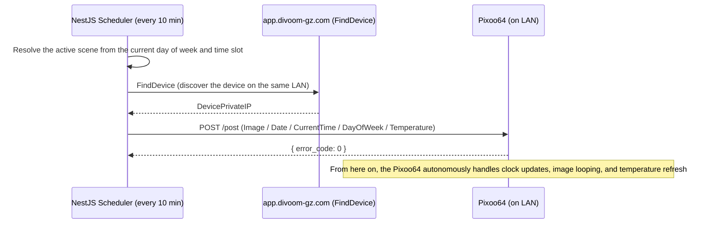
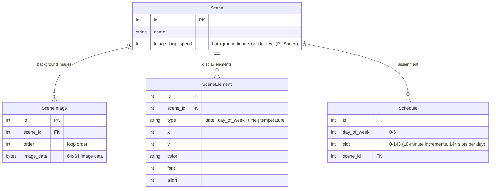

# PixooController_v2

A web application for managing what is displayed on a Divoom Pixoo64 (a 64x64 pixel dot-matrix display) from a browser.

Display content is defined in units called **Scenes**, each combining a background image with date, day-of-week, temperature, and time overlays. A per-day-of-week **Schedule** (in 10-minute increments) determines which scene is pushed to the Pixoo64 automatically.

## Key Features

- **Scene management**: configure a background (64x64, multiple images) plus which elements (date / day of week / temperature / time) to show, along with their position, color, and font
- **Background image loop**: multiple background images are cycled like a GIF at a configurable interval
- **Schedule management**: assign a scene to each day of the week, in 10-minute increments
- **Automatic reflection**: the app pushes the scheduled scene to the Pixoo64 automatically once the corresponding time slot begins

## Assumptions & Constraints

- Only a single Pixoo64 device is managed
- No authentication (assumes personal use on a local home network only)
- Background images are prepared by the user at 64x64 already and uploaded as-is (no server-side resizing)

## Tech Stack

Everything runs in containers.

| Layer | Technology |
| --- | --- |
| Frontend | Next.js + shadcn/ui |
| Backend | NestJS |
| Database | PostgreSQL |

## Architecture

### Communicating with the Pixoo64

The Pixoo64 handles displaying the date, day of week, time, and temperature, as well as looping through multiple background images, **natively on the device itself**. Because of this, the backend only needs to do the following:

1. Once it determines which scene should be active, build the corresponding Pixoo64 Control API command(s) from that scene's configuration (background images and each element's position/color/font)
2. Send the command(s) to the Pixoo64

After a single send, the device continues to advance the clock, refresh the temperature, and loop the background images on its own. There is **no need for the backend to continuously re-render and re-send frames**. The only thing the backend does proactively is evaluate the schedule every 10 minutes and send a command when needed.

### Handling of Device Information

The Pixoo64's IP address and other device information are not persisted in the database. Immediately before sending a command, the app calls the Device Discovery API (`FindDevice`) to find the device on the local network, and sends the Control API request to the discovered IP address.

### Building Commands

Scene settings are mapped onto the Pixoo64 Control API's `CommandList` as follows.

| Scene setting | Corresponding Command |
| --- | --- |
| Background images (multiple, loop interval) | `Image` (`PicNum` / `PicSpeed` / `PicData`, etc.) |
| Date display | `Date` |
| Day-of-week display | `DayOfWeek` |
| Time display | `CurrentTime` |
| Temperature display | `Temperature` |

Each element's position, color, and font are mapped to `ItemList` fields such as `x` / `y` / `font` / `color` / `align`.

> **To be confirmed**: the exact encoding used for `PicData` (the Base64 bitmap format for images) needs to be verified against the real device.

## Data Model (Overview)

- There is no `Device` table (as noted above, the device is discovered on the LAN right before every send instead)

## Development Roadmap

- [ ] **Phase 0: Finalize design**
  - Define the mapping between scene settings and `ItemList` fields
  - Verify the `PicData` bitmap encoding against the real device
  - Choose an ORM (Prisma planned)
- [ ] **Phase 1: Docker foundation**
  - `docker-compose.yml` (web / api / db), Dockerfiles
- [ ] **Phase 2: DB schema & migrations**
  - Scene / SceneImage / SceneElement / Schedule
- [ ] **Phase 3: NestJS API implementation**
  - Scene CRUD, image upload, Schedule CRUD
- [ ] **Phase 4: Pixoo64 integration module**
  - Device discovery client (`FindDevice`)
  - Logic to build `CommandList` from scene settings
- [ ] **Phase 5: Scheduler implementation**
  - A 10-minute cron that resolves the active scene and sends commands to the Pixoo64
- [ ] **Phase 6: Next.js + shadcn frontend**
  - Scene editor screen, schedule management screen (a day-of-week x 10-minute timetable UI)
- [ ] **Phase 7: Integration testing & real-device verification**
- [ ] **Phase 8: Wrap-up**

## Setup

Coming soon. Will be documented once the Docker foundation (Phase 1) is complete.
